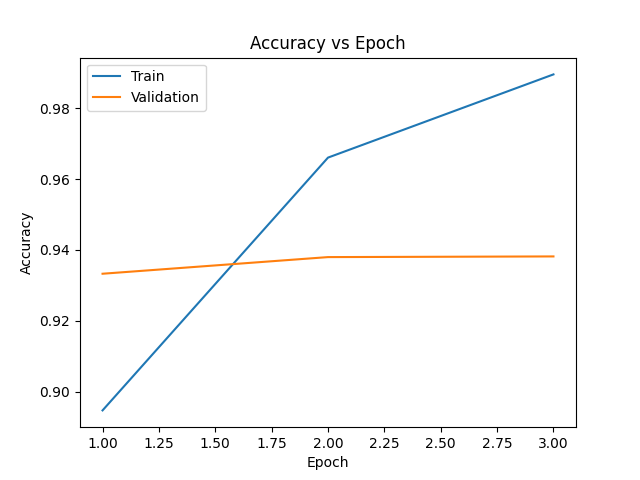
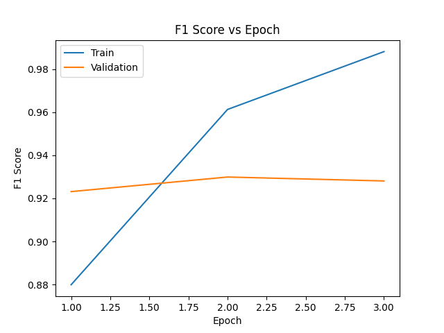
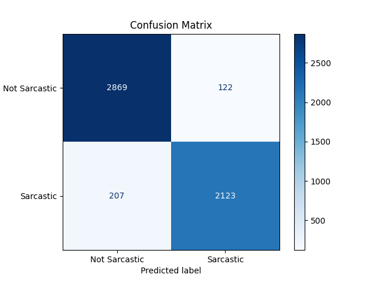
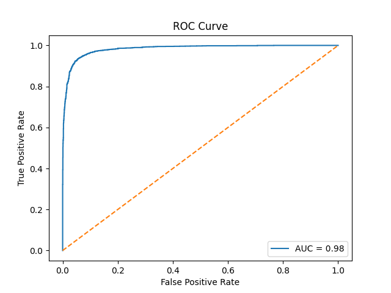

<p align="center">
  
</p>

# Sarcasm Detector

This project is inspired by *The Big Bang Theory*, where the main character, Sheldon Cooper, often fails to understand sarcasm in conversations. To help “Sheldon” (and others) recognize sarcasm in text, I built this sarcasm detection system based on BERT.

## Overview

## Try It Online

👉 [Web App](https://huggingface.co/spaces/your-username/sarcasm-detector)

Enter a headline and see if Sheldon thinks it's sarcastic!

> Demo video to be added soon

## Data
The dataset comes from [Kaggle: News Headlines Dataset for Sarcasm Detection](https://www.kaggle.com/datasets/rmisra/news-headlines-dataset-for-sarcasm-detection), which consists of 29,000+ labeled headlines from news outlets. You could check the original dataset from data/raw_data.json.

Each entry of raw data contains a news headline, a binary label indicating sarcasm (1 for sarcastic, 0 for not sarcastic), and the article link. The dataset is relatively balanced across classes (~52% Not Sarcastic, ~48% Sarcastic).

| headline                                                                                     | is_sarcastic | article_link |
|----------------------------------------------------------------------------------------------|--------------|-------------|
| steady job growth is still not boosting workers' pay, new numbers show                      | 0            | https://www.huffingtonpost.com/entry/steady-job-growth-not-boosting-workers-pay-july_us_55c4b422e4b0d9b743dbc027|
| friday talking points -- gop anti-trump rants                                                | 0            | https://www.huffingtonpost.com/entry/friday-talking-points_b_11484262.html |
| family cell-phone plan area family's closest bond                                            | 1            |https://local.theonion.com/family-cell-phone-plan-area-familys-closest-bond-1819588054 |
| bush calls for rock revolution in weekly pirate-radio address                                | 1            |https://politics.theonion.com/bush-calls-for-rock-revolution-in-weekly-pirate-radio-a-1819567964|

For this project, I preprocessed the data and split it into training and validation sets:
- data/train.csv – 80% of the data, used for training
- data/val.csv – 20% of the data, used for validation


## Code Structure

```
sarcasm-detector/
├── app.py
├── examples.md
├── requirements.txt
├── outputs/
│ └── sarcasm_model/
├── data/
│ ├── raw_data.json
│ ├── train.csv
│ └── val.csv
├── assets/
├── src/
│ ├── train.py
│ ├── predict.py
│ ├── data_preprocessing.py 
│ ├── dataset.py
│ └── utils.py
```

## Results and evaluation

The model was trained for **3 epochs** using a learning rate of `2e-5` and batch size of `16`. The model demonstrates stable improvements and generalization on the validation set.

### Evaluation Metrics (Validation Set)

| Epoch | Accuracy | F1 Score | Precision | Recall |
|-------|----------|----------|-----------|--------|
| 1     | 0.85     | 0.84     | 0.82      | 0.86   |
| 2     | 0.87     | 0.86     | 0.84      | 0.89   |
| 3     | **0.89** | **0.88** | **0.86**  | **0.91** |

> 📁 *Full metrics table available at [`outputs/eval/metrics_table.csv`](outputs/eval/metrics_table.csv)*

### Training Curves

**Accuracy and F1 Score over Epochs**

<p float="left">
  
  
</p>

### Confusion Matrix

Illustrates the distribution of predicted vs. true labels.

<p align="center">
  
</p>

### ROC Curve

The ROC Curve below shows strong separability between sarcastic and non-sarcastic headlines.

<p align="center">
  
</p>


## References
Dataset:
```
@article{misra2023Sarcasm,
  title = {Sarcasm Detection using News Headlines Dataset},
  journal = {AI Open},
  volume = {4},
  pages = {13-18},
  year = {2023},
  issn = {2666-6510},
  doi = {https://doi.org/10.1016/j.aiopen.2023.01.001},
  url = {https://www.sciencedirect.com/science/article/pii/S2666651023000013},
  author = {Rishabh Misra and Prahal Arora},
}
@book{misra2021sculpting,
  author = {Misra, Rishabh and Grover, Jigyasa},
  year = {2021},
  month = {01},
  pages = {},
  title = {Sculpting Data for ML: The first act of Machine Learning},
  isbn = {9798585463570}
}
```